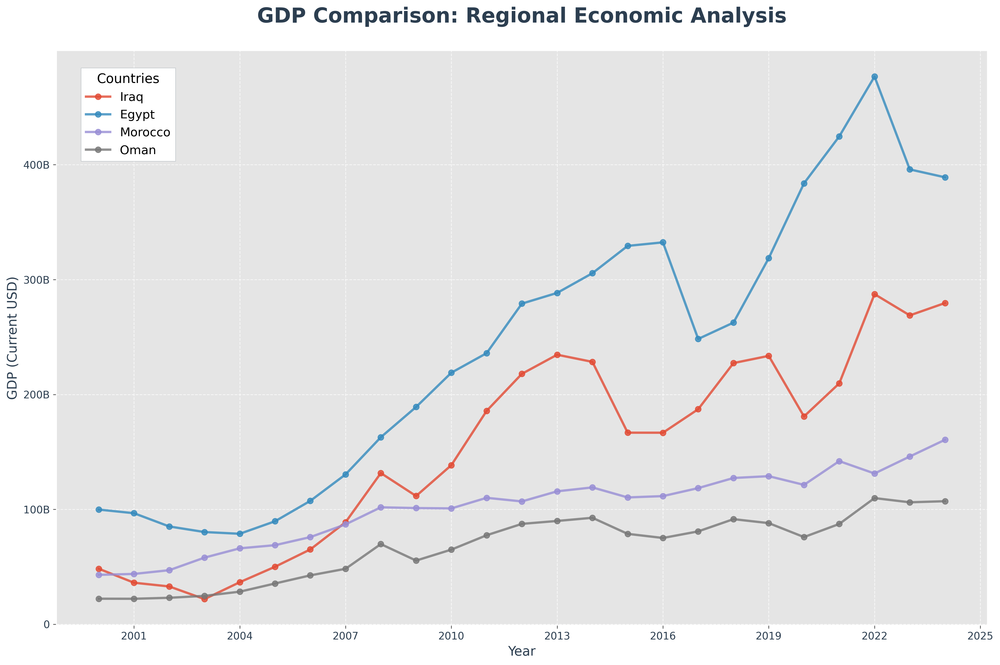
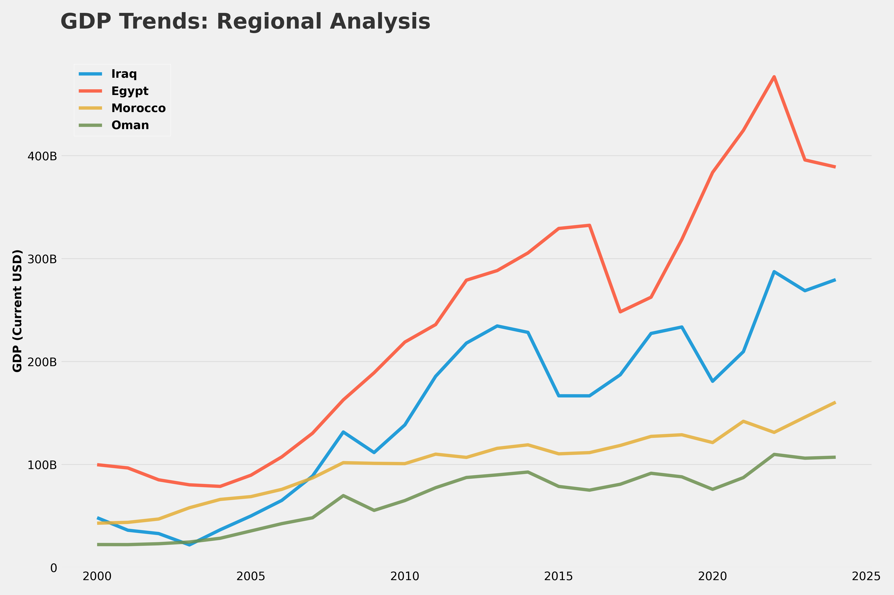
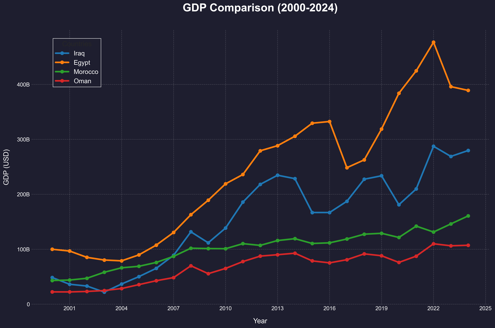
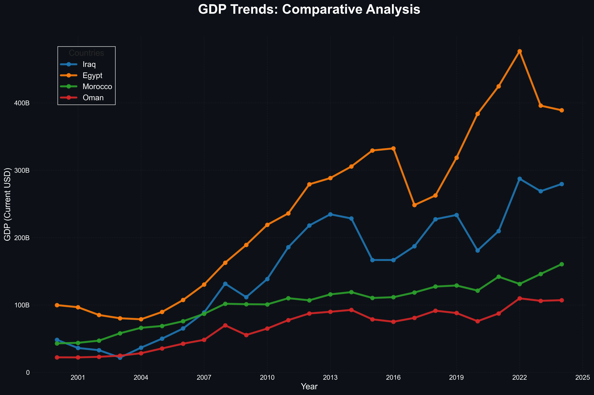

# 📊 The GDP Visualization Masterclass
### *A Technical Demonstration of Economic Data Styling*

This repository is a showcase of high-end data visualization techniques. It demonstrates how to transform raw World Bank data into four distinct professional personas, tailored for Academic, Media, and Executive environments.

---

## ⚔️ The Arsenal (Four Visual Identities)


| **01. The Academic Star** | **02. The Data Journalist** |
| :--- | :--- |
|  |  |
| *Standard `ggplot` style used in peer-reviewed economic journals. Clean, precise, and rigorous.* | *The `fivethirtyeight` style (The Economist/FT). Bold, high-readability, and editorial.* |

| **03. The Premium Midnight** | **04. The Tech Space Grey** |
| :--- | :--- |
|  |  |
| *Custom deep-sea dashboard theme. Designed for high-end executive financial terminals.* | *GitHub-inspired Slate theme. Seamlessly integrated for modern developer portfolios.* |

---

## 🛠️ Technical Prowess
- **Data Engine:** Python / Pandas
- **Visualization:** Matplotlib Core
- **Dynamic Formatting:** Custom `ticker` functions for automatic Trillion/Billion scaling.
- **Versatility:** One dataset, four distinct professional frameworks.

## 🚀 How to Deploy
1. **Clone the arsenal:**
   ```bash
   git clone https://github.com
   ```
2. **Install requirements:**
   ```bash
   pip install pandas matplotlib openpyxl
   ```
3. **Execute any style:**
   ```bash
   python Midnight_Blue_Style.py
   ```

---
*Created with precision. Built for impact.*
